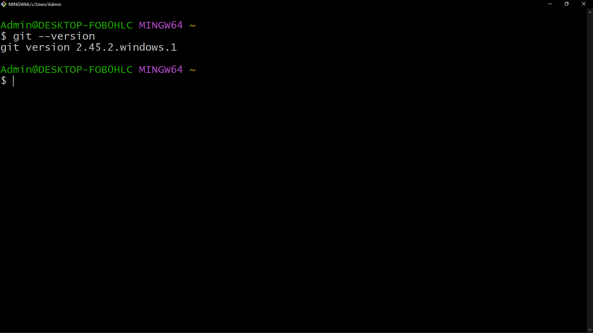
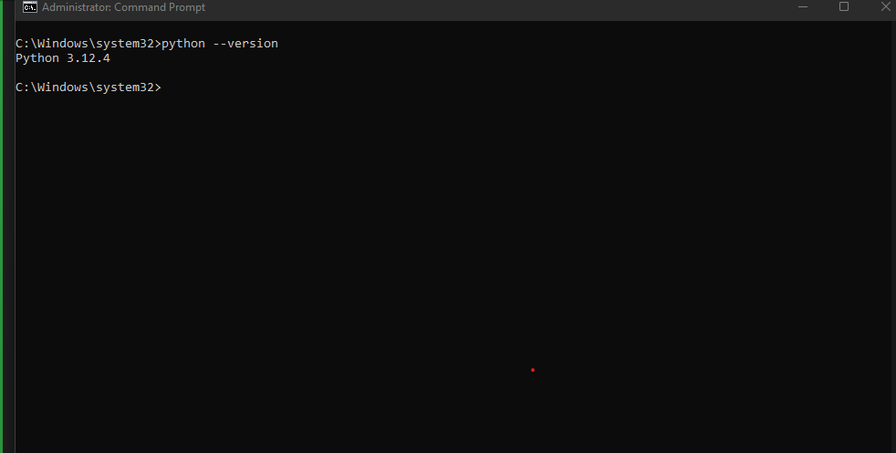
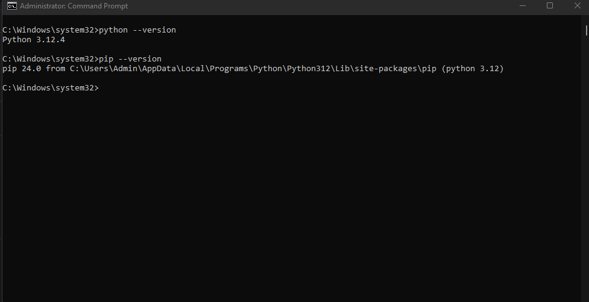
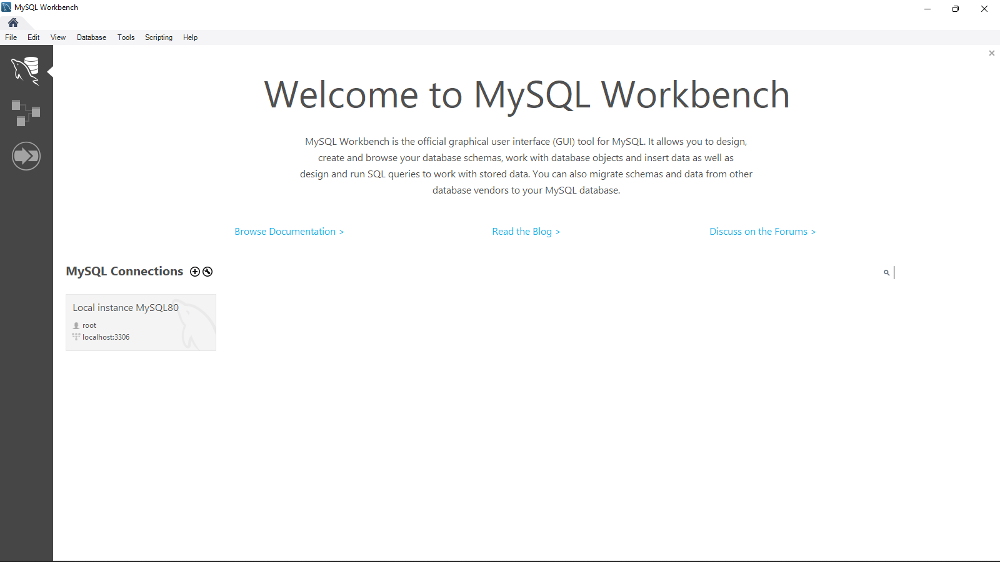

# Dev_Setup
Setup Development Environment

#Assignment: Setting Up Your Developer Environment

#Objective:
This assignment aims to familiarize you with the tools and configurations necessary to set up an efficient developer environment for software engineering projects. Completing this assignment will give you the skills required to set up a robust and productive workspace conducive to coding, debugging, version control, and collaboration.

#Tasks:

1. Select Your Operating System (OS):
   Choose an operating system that best suits your preferences and project requirements. Download and Install Windows 11. https://www.microsoft.com/software-download/windows11

2. Install a Text Editor or Integrated Development Environment (IDE):
   Select and install a text editor or IDE suitable for your programming languages and workflow. Download and Install Visual Studio Code. https://code.visualstudio.com/Download

3. Set Up Version Control System:
   Install Git and configure it on your local machine. Create a GitHub account for hosting your repositories. Initialize a Git repository for your project and make your first commit. https://github.com

4. Install Necessary Programming Languages and Runtimes:
  Instal Python from http://wwww.python.org programming language required for your project and install their respective compilers, interpreters, or runtimes. Ensure you have the necessary tools to build and execute your code.

5. Install Package Managers:
   If applicable, install package managers like pip (Python).

6. Configure a Database (MySQL):
   Download and install MySQL database. https://dev.mysql.com/downloads/windows/installer/5.7.html

7. Set Up Development Environments and Virtualization (Optional):
   Consider using virtualization tools like Docker or virtual machines to isolate project dependencies and ensure consistent environments across different machines.

8. Explore Extensions and Plugins:
   Explore available extensions, plugins, and add-ons for your chosen text editor or IDE to enhance functionality, such as syntax highlighting, linting, code formatting, and version control integration.

9. Document Your Setup:
    Create a comprehensive document outlining the steps you've taken to set up your developer environment. Include any configurations, customizations, or troubleshooting steps encountered during the process. 

    DOCUMETATIONS:
    Task 1:
     - My machine was already running window 11 which was pre installed on purchase. I confirmed this by , pressing the Windows logo key + R and checking the version by searching winver(which is windows version)
     
    
    Task 2:
     - I pasted the link provided on my web browser to install the latest version of visual studio
     - Once the installation was done the opened the setup wizard and followed the step provided ticking the checkboxes to enable various funtionalities 
     
     - After cheking the checkboxes I clicked next to enable installation
     
     - Once installed visual studio code appears in this format
     

    Task 3:
     - I installed git by pasting the link provided in my web browser and following the steps the steup wizard 
     - I then checked the version installed using git --version
     
     - I linked my gitbash to github account 
     - After linking I added a commit message in git bash and pushed it to github
     
     
     

    Task 4:
     - Copied the link provided and pasted it on the web browser and initialized download for python set up wizard
     - On the installer add python to path before installing it
     - After installation i checked to verify the version installed using command prompt using the command python --version
     
    
    Task 5:
     - Pip came installed in the python-3.12.4-amd64.exe package that I installed for python
     - I used comand prompt to check and verify the installation of pip
     
    
    Task 6:
     - Used the link provided in a web browser and initiated download of mysql installer
     - When installer was ready to open and run I choose my setup type as default 
     - Proceed through the installation wizard, accepting the default settings unless you have specific preferences.
     - In the configuring process root password is rquired to sequre the database
     - Finish the installation process and ensure the MySQL Server is running.
     - In youur machine check for my sql workbench
      

    Task 8:
     (Note: I choose visual studio)
     - Open visual studio code
     - Access extensions
     - Search and install the following extensions
       1. Python - Provides rich support for Python, including features like
       autocompletion, linting, debugging, and code navigation.
       2. Prettier - Code formatter - An opinionated code formatter that supports various languages, including Python. It enforces a consistent style by parsing your code and re-printing it with its rules
       3. Live Share - Enables real-time collaborative development within VS Code. You can share your code and debug sessions with teammates.
       4. Dart - Provides rich support for the Dart programming language.
       5. Flutter - Provides support for Flutter development, including Flutter-specific features such as Flutter Doctor and Flutter Run.
       6. GitHub Classroom - Provides integration with GitHub Classroom, making it easier to manage assignments and student repositories.

       

       link - https://github.com/JumaGathairu/Demonstration_Project.git

       Challenges faced:
        1. Slow or Interrupted Downloads - During the download of large files like the Flutter SDK or MySQL installer, slow internet speeds or interruptions caused issues
        2. Compatibility Issues - Sometimes, the downloaded installer may not be compatible with the operating system, leading to installation failures
        3. Incorrect PATH Configuration - Adding Python or Flutter to the PATH incorrectly can lead to command not found errors
        4. Outdated Packages - Using outdated packages can cause compatibility issues with newer tools or libraries.
        5. Performance Issues - Installing too many extensions can slow down the IDE.
        6. Initial Configuration - Setting up Git for the first time can be confusing, especially configuring user details 

       Strategies:
        1. Use Download Managers - To manage large downloads, a download manager can help resume interrupted downloads and manage download speeds.
        2. Check System Requirements - Before downloading, checking the system requirements ensures compatibility and avoids unnecessary installation failures.
        3. Use Official Documentation - Following the official documentation step-by-step helps ensure accurate PATH configuration.
        4. Regular Updates - Regularly updating packages and tools ensures compatibility and access to the latest features and security updates.
        5. Selective Installation - Installing only the necessary extensions for the specific project reduces conflicts and improves performance.
        6. Use GitHub Documentation - GitHub provides comprehensive guides for initial setup and advanced configuration, which can be very helpful.

#Deliverables:
- Document detailing the setup process with step-by-step instructions and screenshots where necessary.
- A GitHub repository containing a sample project initialized with Git and any necessary configuration files (e.g., .gitignore).
- A reflection on the challenges faced during setup and strategies employed to overcome them.

#Submission:
Submit your document and GitHub repository link through the designated platform or email to the instructor by the specified deadline.

#Evaluation Criteria:**
- Completeness and accuracy of setup documentation.
- Effectiveness of version control implementation.
- Appropriateness of tools selected for the project requirements.
- Clarity of reflection on challenges and solutions encountered.
- Adherence to submission guidelines and deadlines.

Note: Feel free to reach out for clarification or assistance with any aspect of the assignment.
